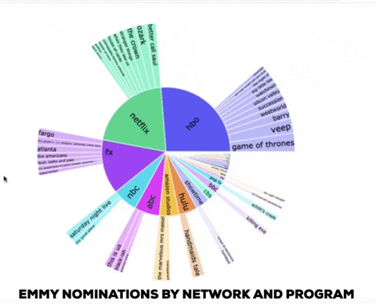

# Sunburst Chart 
## Emmy Nominations By Channel And Television Program

Extract
- Webscrape of Emmys Nominations by television program and network from 2016-2020

Transform
- Used value_counts( ) function to add column displaying frequency of emmy nominations by television program/title
- Forloop to create new DataFrame following labels-parents-value layer in preparation for sunburst plot

Load
- Exported dataFrame to csv
- Mirroed csv table headers and loaded in Postgre.
- From Tables/sunburst_data import sunburst_data.csv.
- Create Flask app to load sunburst_data from Postgre into JSON format
- Use d3.json().then() to create promise 
- Launch interactive browser with API route created to read in data

Visualization
